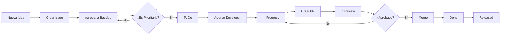

# 📋 Guía de GitHub Projects - Replicon Automator

## 🎯 Configuración del Tablero Kanban (100% Gratuito)

GitHub Projects V2 ofrece automatización potente sin costo adicional.

### 1️⃣ Crear el Proyecto

```bash
# Opción 1: Desde la interfaz web
1. Ve a tu repositorio → Projects → New Project
2. Selecciona "Team backlog" o "Board" template
3. Nombra: "Replicon Automator - Roadmap"

# Opción 2: Vía GitHub CLI (gratis)
gh project create --owner hector26rubio2 --title "Replicon Automator - Roadmap"
```

### 2️⃣ Columnas Recomendadas

```
📥 Backlog       → Ideas y features futuros
🎯 To Do         → Próximas tareas priorizadas
🏗️ In Progress   → Trabajo activo
👀 In Review     → En code review
✅ Done          → Completado (última semana)
📦 Released      → Deployado en producción
```

### 3️⃣ Automatizaciones Nativas (Sin Costo)

#### Automatización 1: Auto-mover Issues
```yaml
# Settings → Workflows → Enable "Item added to project"
Cuando: Un issue se asigna a alguien
Acción: Mover a "In Progress"

# Settings → Workflows → Enable "Item reopened"
Cuando: Un issue se reabre
Acción: Mover a "To Do"

# Settings → Workflows → Enable "Pull request merged"
Cuando: Un PR se hace merge
Acción: Mover a "Done"
```

#### Automatización 2: Auto-cerrar Issues con PRs
```yaml
# En tu PR description, usa:
Closes #123
Fixes #456
Resolves #789

# Cuando el PR se hace merge, los issues se cierran automáticamente
```

### 4️⃣ Labels Estratégicos

Crea estos labels en: Settings → Labels

```yaml
# Por tipo
type: feature        → 🚀 Nueva funcionalidad
type: bug            → 🐛 Error a corregir
type: docs           → 📚 Documentación
type: refactor       → ♻️  Mejora de código
type: security       → 🔒 Seguridad

# Por prioridad
priority: critical   → 🔴 Crítico (color: red)
priority: high       → 🟠 Alto (color: orange)
priority: medium     → 🟡 Medio (color: yellow)
priority: low        → 🟢 Bajo (color: green)

# Por área
area: ui             → 🎨 Interfaz
area: automation     → 🤖 Lógica de Playwright
area: electron       → ⚡ Proceso principal
area: build          → 📦 Build/CI/CD

# Especiales
good first issue     → 👋 Para nuevos contribuidores
help wanted          → 🆘 Se necesita ayuda
dependencies         → 📦 Dependabot
automated            → 🤖 Automatizado
```

### 5️⃣ Issue Templates

Crea: `.github/ISSUE_TEMPLATE/bug_report.yml`

```yaml
name: 🐛 Bug Report
description: Reportar un error en la aplicación
title: "[BUG] "
labels: ["type: bug"]
assignees:
  - hector26rubio2
body:
  - type: markdown
    attributes:
      value: |
        Gracias por reportar este bug. Por favor completa la información.
  
  - type: input
    id: version
    attributes:
      label: Versión
      description: ¿Qué versión de Replicon Automator estás usando?
      placeholder: "Ej: v3.5.0"
    validations:
      required: true
  
  - type: textarea
    id: description
    attributes:
      label: Descripción del problema
      description: ¿Qué esperabas que pasara? ¿Qué pasó realmente?
      placeholder: Describe el bug aquí...
    validations:
      required: true
  
  - type: textarea
    id: steps
    attributes:
      label: Pasos para reproducir
      description: Cómo reproducir el error
      placeholder: |
        1. Abrir la aplicación
        2. Hacer clic en '...'
        3. Ver error
    validations:
      required: true
  
  - type: textarea
    id: logs
    attributes:
      label: Logs de la aplicación
      description: Si hay logs de error, pégalos aquí
      render: shell
  
  - type: dropdown
    id: os
    attributes:
      label: Sistema Operativo
      options:
        - Windows 11
        - Windows 10
        - Windows 8.1
    validations:
      required: true
```

### 6️⃣ Milestones para Releases

```bash
# Crear milestones para versiones
Settings → Milestones → New Milestone

Ejemplos:
- v3.6.0 - Q1 2025 (Due: 2025-03-31)
- v3.7.0 - Q2 2025 (Due: 2025-06-30)
- v4.0.0 - Major Refactor (Due: 2025-12-31)
```

### 7️⃣ GitHub CLI para Automatizar Issues

```bash
# Instalar GitHub CLI (gratis)
# https://cli.github.com/

# Crear issue desde la terminal
gh issue create \
  --title "feat: Add dark mode support" \
  --body "Users requested dark mode" \
  --label "type: feature,priority: medium" \
  --milestone "v3.6.0"

# Listar issues asignados a ti
gh issue list --assignee @me

# Cerrar issue
gh issue close 123 --comment "Fixed in v3.5.1"
```

### 8️⃣ Workflow Recomendado



### 9️⃣ Métricas Gratuitas

GitHub Insights (gratis) te muestra:

- 📊 Velocity: Issues cerrados por semana
- ⏱️ Cycle Time: Tiempo de Issue → Cerrado
- 📈 Burndown: Progreso hacia milestones
- 👥 Contributors: Quién hace qué

Accede en: `Insights → Pulse / Contributors / Community`

### 🔟 Integraciones Gratuitas

```yaml
# GitHub Mobile App (iOS/Android)
- Recibir notificaciones push
- Revisar y aprobar PRs
- Cerrar issues desde el móvil

# VS Code Extension: GitHub Pull Requests
code --install-extension GitHub.vscode-pull-request-github

# Slack (free tier)
# Conectar: Settings → Integrations → Slack
# Recibir notificaciones de Issues/PRs en Slack
```

## 🎓 Pro Tips

1. **Usa Draft PRs**: Para mostrar trabajo en progreso sin trigger CI/CD completo
2. **Saved Replies**: Settings → Saved Replies → Crea respuestas comunes
3. **Keyboard Shortcuts**: Presiona `?` en GitHub para ver atajos
4. **Mentions**: Usa `@hector26rubio2` para notificar
5. **Emoji Reactions**: +1 👍 para aprobar ideas sin comentar

## 🚀 Siguiente Nivel

```bash
# Automatización avanzada con GitHub Actions (gratis)
# Crear issues automáticamente cuando algo falla

- name: Create issue on failure
  if: failure()
  uses: actions/github-script@v7
  with:
    script: |
      github.rest.issues.create({
        owner: context.repo.owner,
        repo: context.repo.repo,
        title: '🔥 Build Failed in CI/CD',
        body: 'Automated issue created from workflow failure',
        labels: ['type: bug', 'priority: critical', 'automated']
      })
```

---

**¿Necesitas ayuda?** Abre un [Issue](https://github.com/hector26rubio2/replicon-automator/issues/new/choose) usando los templates.
